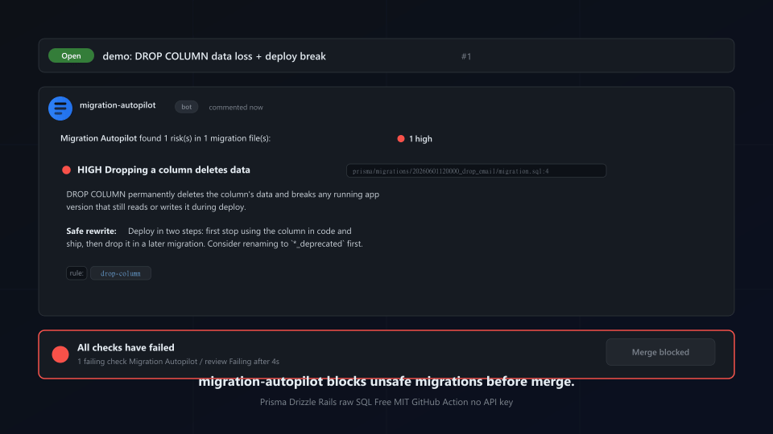

# 🗃️ Migration Autopilot

[](https://github.com/marketplace/actions/migration-autopilot)
[](LICENSE)
[](#supported-migrations)
[](#quick-start)

**Reviews every database-migration PR and blocks the ones that lock your production table or drop data — Prisma, Drizzle, Rails, raw SQL.**



📺 **[Watch the 60s demo →](https://www.loom.com/share/ab8d293bd8b94baa89fb6ab090a2c974)** (real PRs with `DROP COLUMN`, `ADD NOT NULL` and a non-`CONCURRENTLY` index — each caught, merge blocked.)

A migration that ran in 0.4s on staging can lock your `users` table for 20 minutes in production. `ALTER COLUMN ... SET NOT NULL`, a non-`CONCURRENTLY` index, a `NOT NULL` column with a backfill, a column type change — each takes an exclusive lock and scans every row. Generic AI review bots don't model lock semantics. Migration Autopilot does: it reads each PR's migration files and flags the operations that cause downtime or data loss, with a safe rewrite for each.

> **Two ways to use it**
> - 🆓 **Free GitHub Action** (this repo) — deterministic rule engine, no API key needed. Setup below.
> - ⚡ **Hosted Pro** — 1-click install, no CI setup, dashboard + history. [Install the app →](https://migration.useautopilot.dev) *(coming soon)*

---

## Quick start

Create `.github/workflows/migration-review.yml`:

```yaml
name: Migration Autopilot

on:
  pull_request:

permissions:
  contents: read
  pull-requests: write

jobs:
  review:
    runs-on: ubuntu-latest
    steps:
      - uses: isabellehuecloser-ctrl/migration-autopilot@v0
        with:
          fail-on: high        # block merge on high-severity risk (or: medium / never)
          dialect: postgres    # default dialect for raw .sql files
```

That's it. On every PR that touches a migration, the bot posts a review and (with `fail-on: high`) fails the check so you can require it as a merge gate.

**No OpenAI key required.** The detection is a deterministic rule engine. Set an optional `api-key` only if you want each finding enriched with a plain-English explanation:

```yaml
        with:
          api-key: ${{ secrets.OPENAI_API_KEY }}
```

---

## What it detects

| Severity | Rule | Why it's dangerous |
|----------|------|--------------------|
| 🔴 high | `drop-column`, `drop-table`, `truncate` | permanent data loss |
| 🔴 high | `set-not-null` | ACCESS EXCLUSIVE lock + full-table scan |
| 🔴 high | `add-column-not-null-no-default` | fails on any non-empty table |
| 🔴 high | `change-column-type` | rewrites the whole table under a lock |
| 🔴 high | `create-index-not-concurrent` | blocks writes while the index builds |
| 🔴 high | `prisma-concurrently-in-txn` | `CONCURRENTLY` can't run in Prisma/Drizzle's wrapped transaction |
| 🟡 medium | `add-foreign-key`, `add-check-constraint`, `add-unique-constraint` | validate every row under a lock (use `NOT VALID`) |
| 🟡 medium | `rename-column`, `rename-table` | breaks the running app mid-deploy |
| 🔵 low | `drop-index-not-concurrent`, `add-column-volatile-default` | brief lock / table rewrite |

Each finding comes with a **safe rewrite** (e.g. "add `CHECK ... NOT VALID`, then `VALIDATE CONSTRAINT` in a separate migration").

## Supported migrations

| Source | Detected from |
|--------|---------------|
| **Prisma** | `prisma/migrations/**/migration.sql` |
| **Drizzle** | `drizzle/*.sql`, `**/migrations/0000_*.sql` |
| **Rails / ActiveRecord** | `db/migrate/*.rb` (Ruby DSL → analyzed without a Ruby runtime) |
| **Raw SQL** | any `*.sql` under a `migration`/`migrate`/`schema`/`ddl` path |

Postgres and MySQL dialects (Postgres-specific rules don't fire on MySQL).

---

## Inputs

| Input | Default | Description |
|-------|---------|-------------|
| `fail-on` | `high` | Minimum severity that fails the check: `high`, `medium`, `never`. |
| `dialect` | `postgres` | Default dialect for raw `.sql` (`postgres` / `mysql`). ORM files auto-detect. |
| `api-key` | — | Optional OpenAI key for plain-English explanations. Engine works without it. |
| `model` | `gpt-4o-mini` | Model used only for the optional explanation. |
| `max-files` | `50` | Max migration files reviewed per run. |
| `github-token` | `${{ github.token }}` | Token to read the PR and post the review. |

## Outputs

| Output | Description |
|--------|-------------|
| `findings-count` | Total number of findings. |
| `highest-severity` | `high` / `medium` / `low` / `none`. |

---

## Why not just CodeRabbit / Squawk / Atlas?

- **Generic AI reviewers** (CodeRabbit, Greptile, Qodo) don't specialize in migration lock semantics.
- **Squawk** is excellent but Postgres-only, raw-SQL-only, and you wire up the CI yourself.
- **strong_migrations** is Rails-only.
- **Atlas** paywalled its migration linter in late 2025.

Migration Autopilot is the install-and-go, multi-ORM, PR-native option — zero config, free Action, deterministic (so it doesn't hallucinate), with a hosted Pro tier when you want the dashboard.

---

## How it works

1. Reads the PR's changed files via the GitHub API (no checkout).
2. Classifies which files are migrations and from which ORM.
3. Extracts the **added** SQL/DSL lines, parses them into statements (comment- and string-literal-aware).
4. Runs a deterministic rule corpus derived from real production incidents.
5. Posts a single PR comment and sets the check status per `fail-on`.

The rule corpus is the product. It's guarded by a 50-case golden-set eval (`npm run evals`) that fails CI on any regression **or any false positive** — a merge-gating tool must not cry wolf.

## Development

```bash
npm install
npm run typecheck
npm test          # unit tests (vitest)
npm run evals     # golden-set precision/recall/F1 gate
npm run build     # bundle to dist/ via ncc
```

## Star history & feedback

If this Action catches a footgun on a real PR of yours — drop a ⭐. That's how
I know it's landing somewhere. Issues, false-positive reports, and rule
suggestions all welcome.

## License

MIT © useAutopilot
